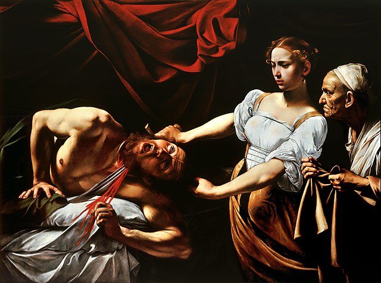
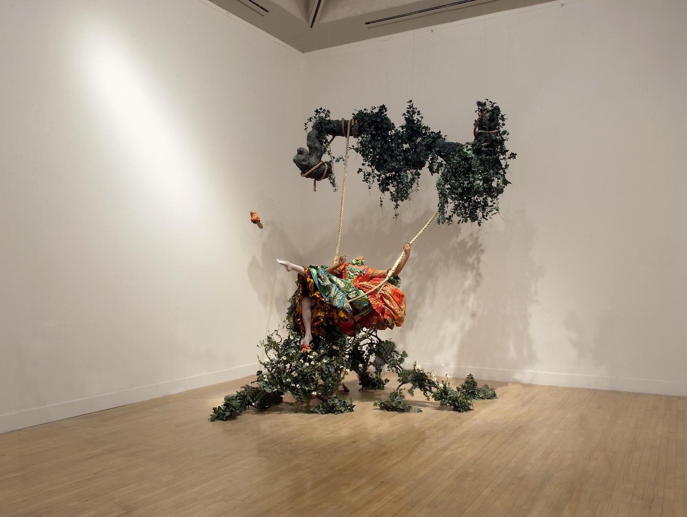
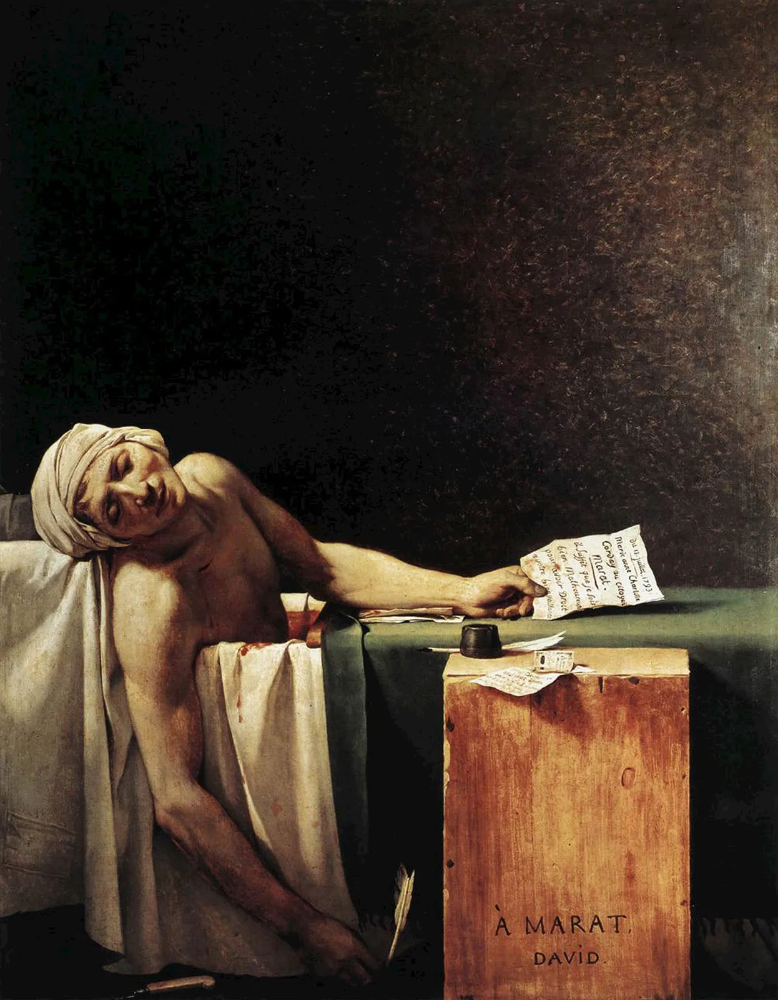

Assignment 1 for LMC2700

<!DOCTYPE html>
<html>
<head>
    <title>My Favorite Artworks</title>
    <link rel="stylesheet" type="text/css" href="styles.css">
</head>
<body>
    <h1 id="Heading">My Favorite Artworks</h1>
    

        

            <a href="#section1">The Kiss</a> 
            <a href="#section2">Judith Beheading Holofernes</a> 
            <a href="#section3">The Swing (After Fragonard)</a> 
            <a href="#section4">The Death of Marat</a>
        

        

            <h1 class="headers">The Kiss by Gustav Klimt</h1>
            

                

                

                    

                        Gustav Klimt's The Kiss, painted in 1907-1908, is one of the most iconic works of the Vienna Secession movement and is renowned for its sensual and decorative qualities. The painting depicts a couple embracing, their bodies entwined and covered in elaborate golden patterns. 
                         
                        The meaning of The Kiss can be interpreted in several ways: 
                         
                        Intimacy and Love: The painting captures a moment of deep intimacy and tenderness. The embrace, coupled with the intricate gold patterns, suggests a profound and almost spiritual connection between the lovers. 
                         
                        Symbolism and Ornamentation: Klimt's use of gold leaf and symbolic patterns serves to elevate the scene to a more ethereal plane. The ornate background and clothing of the figures might symbolize a divine or transcendent love, reflecting the artist's fascination with the intersection of the spiritual and the earthly. 
                         
                        Art Nouveau Influence: The work exemplifies Klimt's mastery of the Art Nouveau style, characterized by its decorative elegance and emphasis on beauty. The painting's ornamental quality reflects a broader cultural fascination with beauty and the decorative arts during the early 20th century. 
                         
                        Overall, The Kiss is celebrated for its emotional depth and its stunning visual aesthetics, blending sensuality with spiritual symbolism in a way that continues to captivate audiences.

                

            

            <h1 class="headers">Judith Beheading Holoferns by Caravaggio</h1>
            

                

                

                    
Caravaggio's Judith Beheading Holofernes, painted around 1598-1599, is a dramatic and powerful depiction of the biblical story of Judith and Holofernes. The painting portrays the moment Judith, a courageous Jewish widow, decapitates the Assyrian general Holofernes to save her city from his siege. 
                         
                        Meaning and Interpretation: 
                         
                        Heroism and Femininity: The painting highlights Judith's bravery and strength, challenging traditional gender roles by depicting a woman as the savior of her people. Her intense focus and resolute expression emphasize her role as a determined heroine. 
                         
                        Violence and Realism: Caravaggio is known for his dramatic realism and use of chiaroscuro (the contrast between light and dark). In this work, the graphic portrayal of violence and the raw, realistic details of the beheading emphasize the brutality of the act, enhancing the painting's emotional impact. 
                         
                        Moral and Psychological Complexity: The expressions of both Judith and her maid, who assists in the act, are intense and complex, reflecting a mix of determination, fear, and revulsion. This psychological depth adds layers to the narrative, making it more than just a historical or biblical event but a study of human emotion and morality. 
                         
                        Overall, Caravaggio's Judith Beheading Holofernes is a striking exploration of heroism, violence, and the complexity of human emotions, rendered with the artist's signature dramatic flair and intense realism.

            

            

            
<h1 class="headers">The Swing (After Fragonard) by Yinka Shonibare</h1>

            

                

                

                    
Yinka Shonibare's The Swing (After Fragonard), created in 2001, is a contemporary reimagining of Jean-Honoré Fragonard's 18th-century painting The Swing. Shonibare's version retains the playful and whimsical tone of the original but adds layers of social and cultural commentary. 
                         
                        Meaning and Interpretation: 
                         
                        Postcolonial Commentary: Shonibare, who uses fabric from traditional African textiles, dresses the figures in his reinterpretation with vibrant, patterned fabrics. This choice highlights themes of colonialism and cultural identity, contrasting the opulence and frivolity of the European aristocracy with the broader context of global history and cultural exchange. 
                         
                        Social Critique: By maintaining the original composition but altering the context, Shonibare critiques the inequalities and pretensions of the elite class depicted in Fragonard’s work. The juxtaposition of the 18th-century aristocratic setting with African textiles serves to question issues of privilege, power, and exploitation. 
                         
                        Visual and Cultural Fusion: The work blends Western and African visual cultures, challenging traditional boundaries and emphasizing the interconnectedness of global histories. The playful and provocative nature of the piece encourages viewers to reconsider preconceived notions about art, history, and cultural heritage. 
                         
                        Overall, Shonibare’s The Swing (After Fragonard) is a thought-provoking commentary on colonialism, cultural identity, and social critique, all while engaging with the aesthetics and themes of its historical source.

            

            

            <h1 class="headers">The Death of Marat by Jacques-Louis David</h1>
            

                

                

                    
Jacques-Louis David's "The Death of Marat," painted in 1793, depicts the assassination of the revolutionary leader Jean-Paul Marat. The painting shows Marat, a prominent Jacobin and radical journalist, murdered in his bath by Charlotte Corday, a political adversary. David presents Marat as a martyr of the Revolution, highlighting his calm and dignified posture despite the violence of his death. The work is both a political statement and a dramatic portrayal of revolutionary fervor. It reflects themes of sacrifice and political idealism, using a stark composition and subdued colors to underscore the tragic and heroic aspects of Marat's death.

            

            

        

    

</body>
</html>
